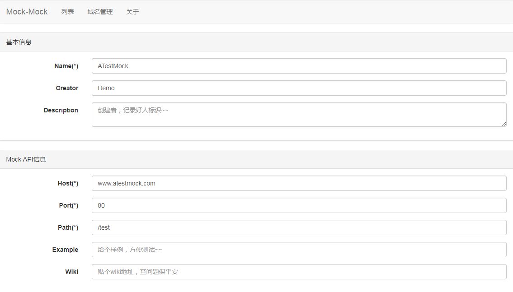
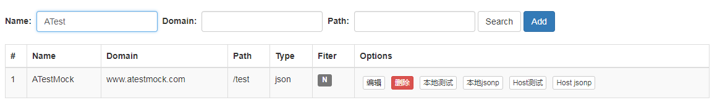
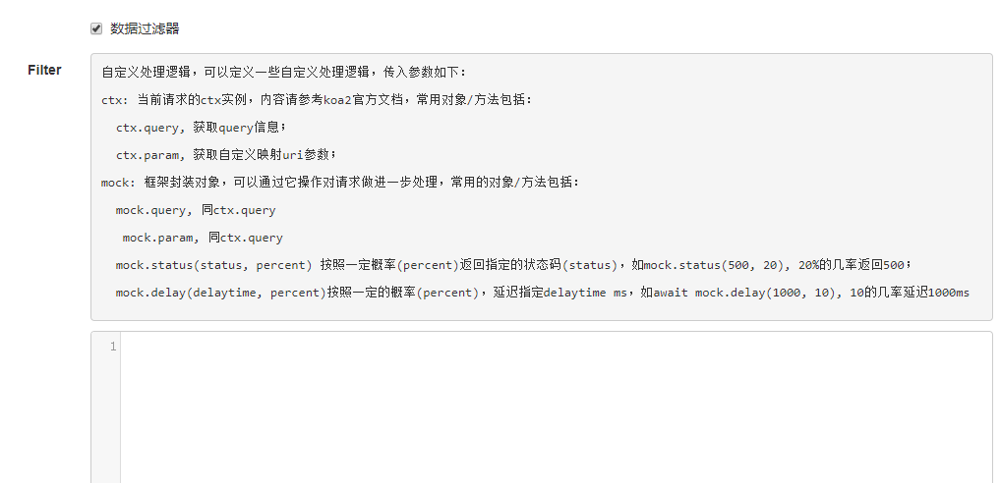
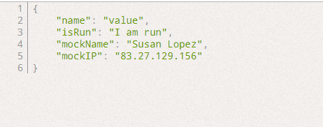

# 如何使用
接下来会通过一个例子，讲述mock的使用。

## 简单Demo
* Step1, 打开首页，点击【新增】进入编辑页面。    
* Step2, 依次输入如下信息      
	Name ATestMock    
	Creator Demo    
	Host www.atestmock.com         
	Port 80       
	Path /test       
	Content {"name": "value"}
	
* Step3, 点击【Submit】
* Step4, 回到首页(或列表页)，就会看到一个ATestMock的列。
	
* Step5, 点击本地测试，得到如下内容：
	```javascript
	{
    	"name": "value"
	}
	```
* Step6, 回到首页(或列表页)，点击jsonp测试，得到如下内容：
	```javascript
	try {
		jQuery1502877145573({
			"name": "value"
		});
	} catch (e) {}
	```
* Step7, 回到首页(或列表页)，点击host测试，你会服务器无响应。
* Step8, 本地配置host，由于之前配置的host为`www.atestmock.com`，因此你需要配置本地host，如：
	```conf
	10.110.28.204	www.atestmock.com
	```
	此时你会到如下内容：
	```javascript
	{
    	"name": "value"
	}
	```
	跟点击本地测试的结果一毛一样。

## 配置Filter
在上个例子的基础上修改。
* Step1, 在首页(或列表页)，找到`ATestMock`，点击【编辑】，进入编辑页面；
* Step2, 勾选底部的【数据过滤器】，页面会弹出Filter输入框；
	
* Step3, 输入如下内容
	```javascript
	// 10%的概率等待100ms
	await mock.delay(100, 10);
	// 10%的概率返回404
	mock.status(404, 10);
	// 30%的概率执行自定义函数
	mock.run(function(){
		mock.result.isRun = "I am run";
	}, 30);
	// 使用mockAPI
	mock.result.mockName = MockJS.mock("@name");
	mock.result.mockIP = MockJS.mock("@ip");
	```
* Step4, 点击【Submit】，回到列表页面，并点击【本地测试】，得到结果跟下面类似，或者返回404.
	
	

**更多详细信息请访问[API](./api.md)**


	