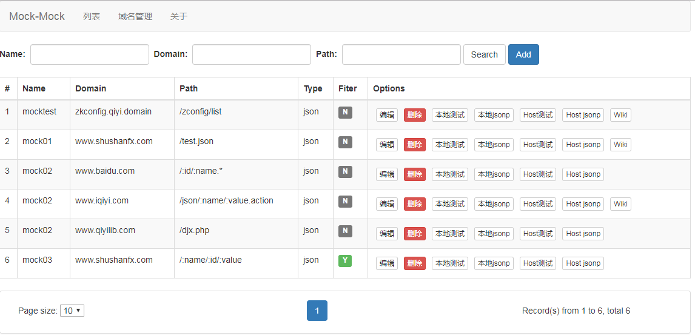
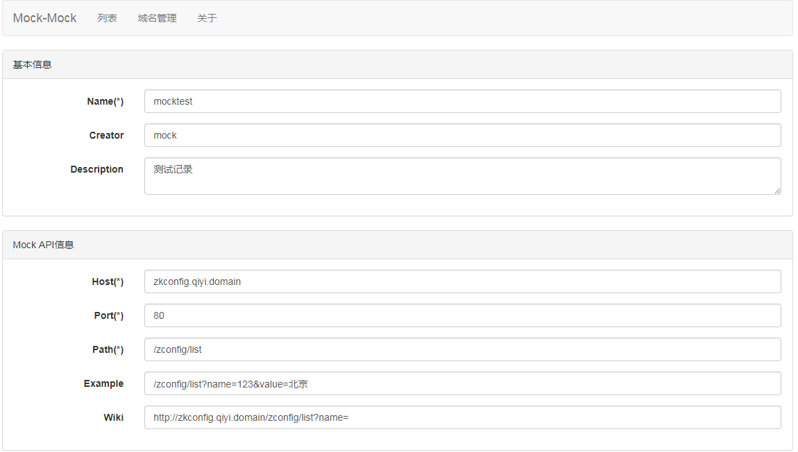
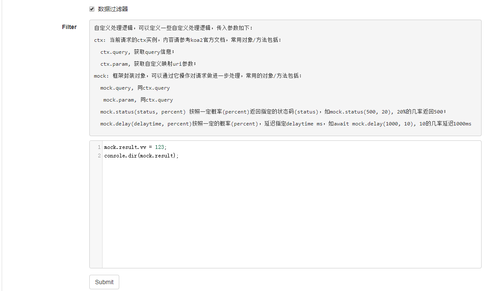

# API-MOCK

不知你是否遇到此类情况：后台接口持续开发中，前端进度不依不饶，又或者是需要变化后台数据的某些状态，以验证展现是否正常。那么，如果你对这些情况束手无策时，不妨考虑这个 mock 平台。

## 目标

API Mock 平台，为了解决如下需求：

1. 后台接口没有准备好，随时 mock 一个接口出来；
2. 管理后端接口，对后端接口有一个大致的了解。

## 如何使用

目前功能相对比较简单，只提供了简单的列表页面和编辑页面：

### 样例

样例请查看[example](./doc/example.md)

### 列表页


具体功能如下：

> 1. 点击【Add】跳转至编辑页，新增 api 配置；
> 2. 点击【编辑】跳转至指定的 api 编辑页进行编辑；
> 3. 点击【本地测试】【本地 jsonp】，跳转至本地的一个测试页面，测试 url 形如[`http://localhost:8001/mock/test.php?mock-host=www.baidu.com&mock-path=%2Fzconfig%2Flist%3Fname%3D123%26value%3D%E5%8C%97%E4%BA%AC`](http://localhost:8001/mock/test.php?mock-host=www.baidu.com&mock-path=%2Fzconfig%2Flist%3Fname%3D123%26value%3D%E5%8C%97%E4%BA%AC)
> 4. 点击【host 测试】【host jsonp】，跳转至一个真实的 url 地址，如果需要看 mock 效果，则需要配置 host。
> 5. wiki，跳转至指定的 wiki 地址。

### 编辑页

新增&修改均会进入编辑，可以对 api 的属性、内容等进行编辑。

各字段定义如下：

**基本信息**

| 名称        | 对应字段    | 描述                                       | 必填 |
| ----------- | ----------- | ------------------------------------------ | ---- |
| Name        | name        | API 接口的名称                             | Y    |
| Creatator   | creator     | 创建者信息，嵌入用户系统后需要实现该字段   | N    |
| Description | description | 接口的描述信息，后续考虑支持 markdown 语法 | N    |

**API 信息**

| 名称    | 对应字段 | 描述                                                                | 必填 |
| ------- | -------- | ------------------------------------------------------------------- | ---- |
| Host    | host     | 需要 mock 的服务器域名，如`www.iqiyi.com`等                         | Y    |
| Port    | port     | 需要 mock 的服务器端口，默认 80                                     | Y    |
| Path    | path     | 接口的映射规则，如`/:name.do`、`/index.action`等，注意要使用`/`开头 | Y    |
| Example | example  | path 的样例，允许带参数，如`/index.do?key=123`                      | N    |
| Wiki    | wiki     | 真实接口的 wiki 地址。                                              | N    |

**API 内容**

| 名称           | 对应字段  | 描述                                   | 必填 |
| -------------- | --------- | -------------------------------------- | ---- |
| Data Type      | type      | 接口的数据类型，支持 json              | html | xml 等格式 | Y |
| 前置操作       | isBefore  | 是否启用抓取前过滤                     | N    |
| Before Get     | onBefore  | 前置过滤内容                           | N    |
| 使用自定义数据 | isContent | 是否使用自定义数据                     | N    |
| Content        | content   | 接口的内容                             | N    |
| 数据过滤器     | isFilter  | 是否开启过滤器(filter)                 | N    |
| Filter         | filter    | 过滤器脚本，请参考下文的`自定义Filter` | N    |

### 前置操作、自定义 Filter

可以通过 mock 平台的编辑页自定义接口的处理，并将处理结果插入 response。自定义 filter 的处理如下图：

编辑自定 filter 需注意如下事项：

> 1. 如果需要开启 fiter，则需要勾选自定 filter，否则将不进行处理。
> 2. 内容部分可以输入 s 语句，系统提供两个传入参数`ctx`和`mock`，详细信息见下；
> 3. 通过修改 mock.result，达到修改返回值的目的。

**ctx**
基 koa2 传入的请求上线文，提供诸如`ctx.query`、`ctx.param`之类的方法。

**mock**
mock 实例对象，提供一系列辅助方法。

> **mock.query**: query 对象，等同于`ctx.query`;  
> **mock.param**: 通过 path 匹配的 param 对象，如 path `/:name1/:name2`，匹配成功之后`mock.param`的值为`{name1 : value, name2: value}`，详细的匹配规则，请参考[url-pattern](https://www.npmjs.com/package/url-pattern);  
> **mock.result**: 需要回显至 response 的对象，如果 api 的数据格式(type)为 json，该属性为一个 json 对象。
> **mock.path**: 当前匹配的路径  
> **mock.host**: 当前的 host  
> **mock.port**: 当前的 port  
> **mock.item**: 从数据库检索出的 mock 实例对象，各字段内容跟上文表格中保持一致。  
> **mock.cwd**: 当前工程的目录  
> **mock.request**: request 对象，可用于发送 http 请求，如`await mock.request("http://www.iqiyi.com/a.json").then(function(){})`，详细文档请参考[request-promise](https://github.com/request/request-promise)  
> **mock.require**: _warnning，等同于`require`函数，不建议使用_，后续会增加配置功能，禁止嵌入该属性。  
> **mock.delay(timeout, percent)**: 有指定百分比(percent,0-100)的概率延迟指定时间(timeout ms)，如果 percent 未提供，则表示 100. 如`await mock.delay(1000, 20)`，有 20%的概率延迟 1000ms。  
> **mock.status(status, percent)**: 有指定百分比(percent,0-100)的概率返回指定的状态码，如果 percent 未提供，则表示 100。 如`mock.status(500, 30)`，有 30%的概率返回 500 的状态码。  
> **mock.run(fun, percent)**: 有指定百分比(percent,0-100)的概率执行指定函数(fun)，如果 percent 未提供，则表示 100。如`mock.run(function(){mock.result._id=1;}, 20)`。  
> **mock.random(percent)**: 判断是否在 percent 之内，之内则返回 true，否则返回失败。如`mock.random(10)`，`mock.delay`/`mock.status`/`mock.run`均依赖该方法。

**注意**
对于 promise 对象，需要使用 await 关键字修饰，其中`mock.delay`和`mock.request`方法返回 promise 对象。
[API 详情](./doc/api.md)

## Filter 样例

```javascript
// 20%的概率返回500
mock.status(500, 20);
// 10%的概率延迟200ms
await mock.delay(200, 10);
// 请求远程地址，返回mock
let result = await mock.request('http://www.iqiyi.com/a.json');
// 修改result内容，返回至response。
mock.result = result;
```

## 安装

- 数据安装，mongodb 安装，完成之后执行`init/db.js`的脚本即可

- 下载代码，并运行
  `bash git clone https://github.com/shushanfx/api-mock.git cd api-mock # 如果需要配置数据库，请自行配置 npm install && npm start`

## 感谢

项目中引入了一些开源库，感谢相关开源项目以及开源的同学，你们太伟大了！

- config
- koa
- koa-send
- koa-bodyparser
- merge
- mockjs
- mongoose
- pug
- url-pattern

> _tips: 由于篇幅限制，只列举了部分引用项目。_

## LICENSE

MIT
